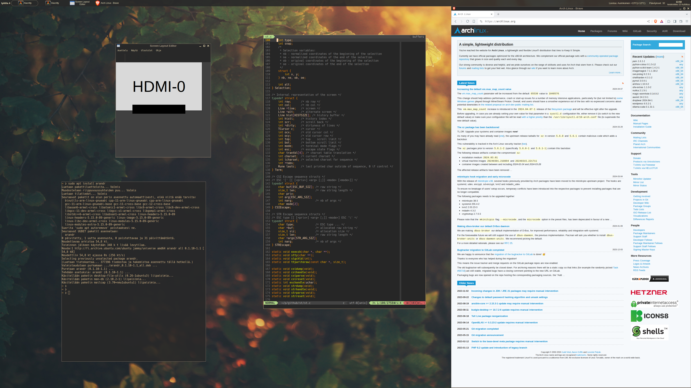

# My dotfiles

* wm: openbox
* compositor: picom
* panel: tint2
* terminal: alacritty
* lockscreen: xsecurelock
* wallpaper: feh
* browser: brave
* notifications: dunst, libnotify
* text editor: neovim

